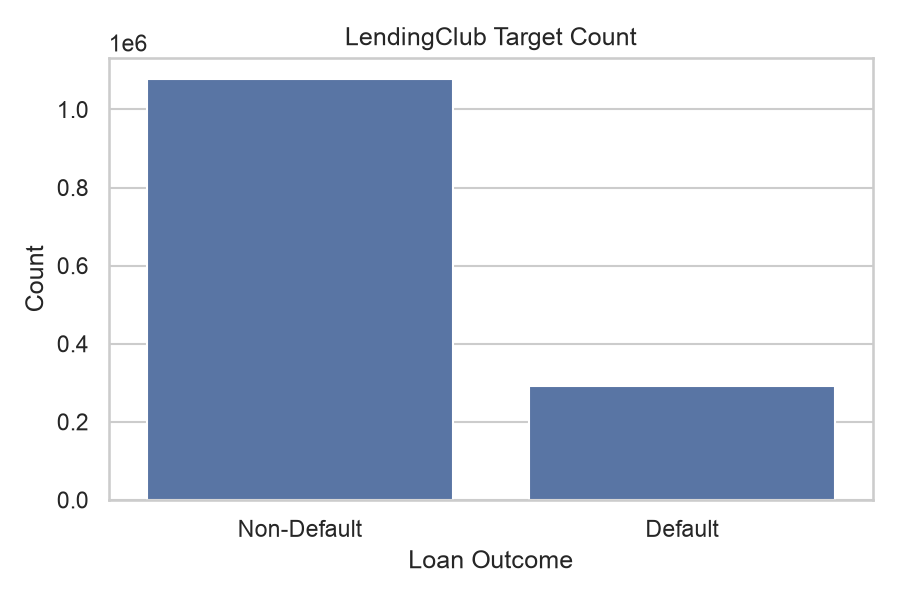
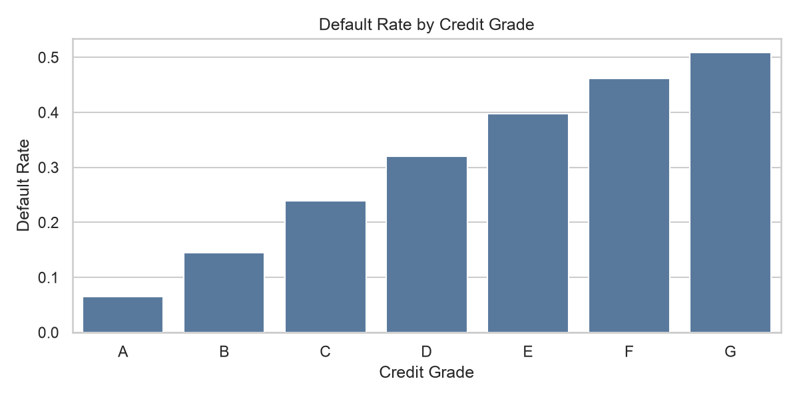
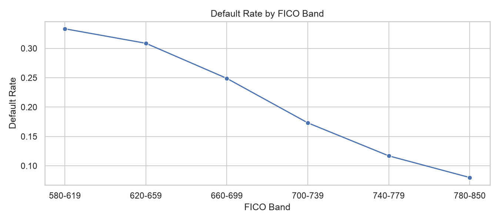
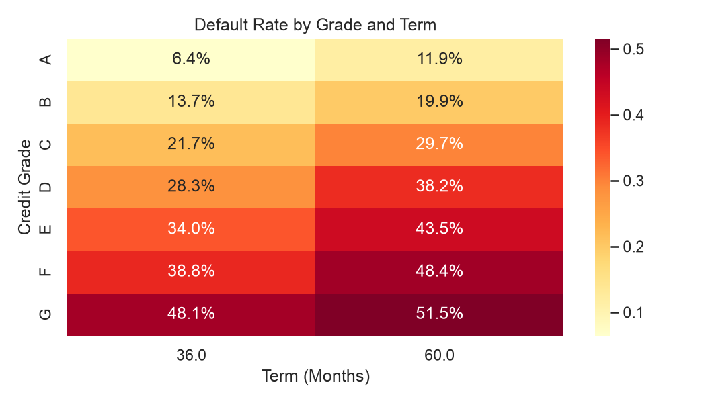
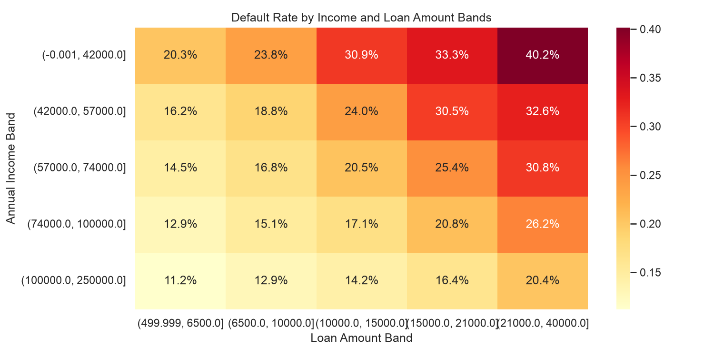
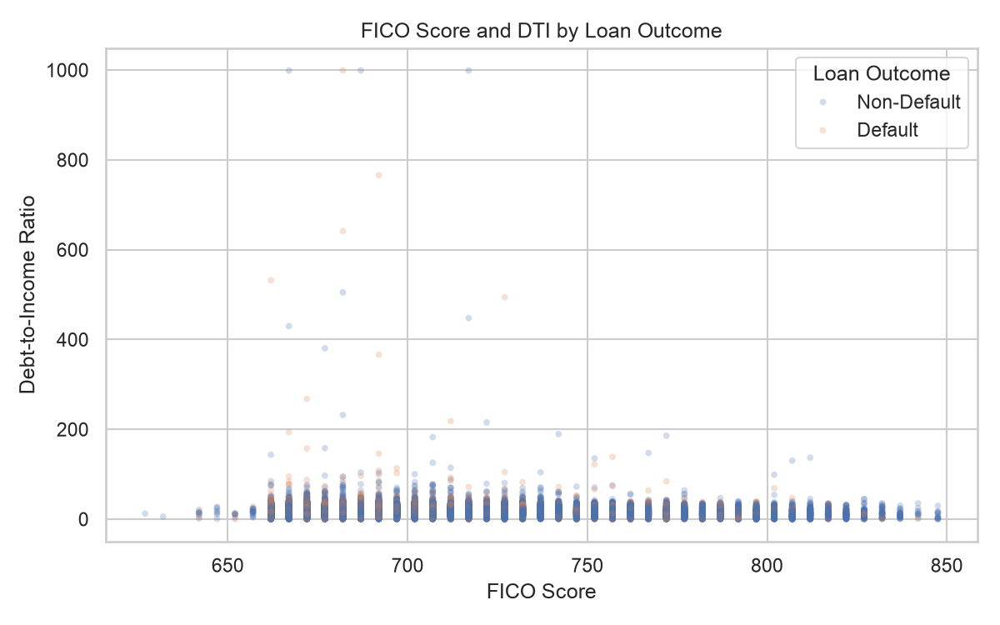
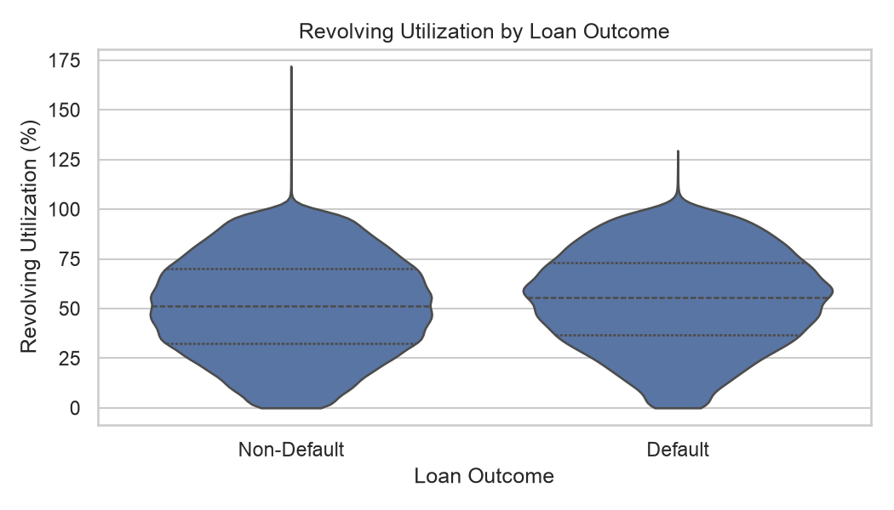
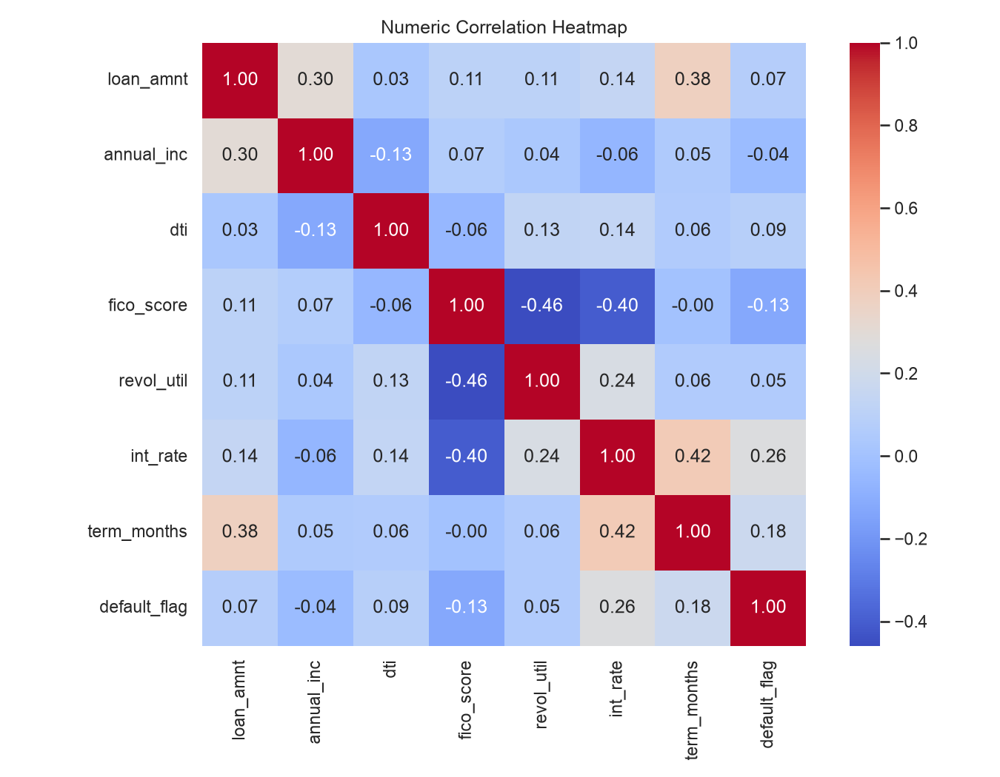
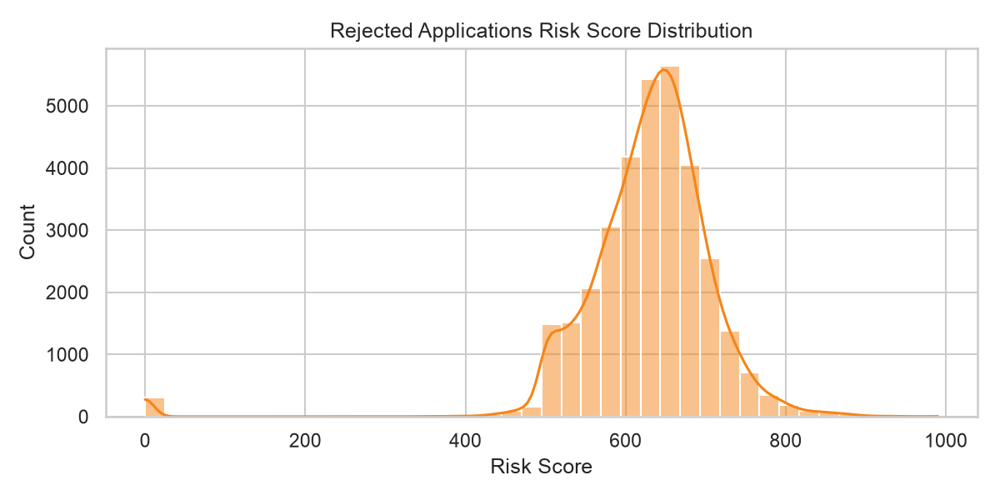
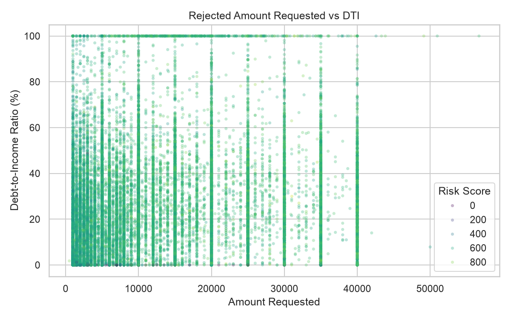

# Credit Risk Intelligence and Decision Platform

This project is an end-to-end credit risk analysis and decision platform built with Python. It covers data cleaning, feature engineering, default prediction, credit scoring, loan approval recommendation, batch risk assessment, expected loss calculation, and Streamlit-based visualization.

## Project Scope

- Project overview: The platform builds an end-to-end credit risk analysis and decision workflow in Python, covering data cleaning, feature engineering, default prediction, credit scoring, and loan approval recommendation generation.
- Data source: The project uses approximately 2.26 million public LendingClub loan records from 2007 to 2018. From more than 150 raw fields, it selects core credit-risk features such as loan amount, annual income, FICO score, debt-to-income ratio, and revolving utilization.
- Core algorithms: The modeling workflow compares logistic regression, decision tree, random forest, and gradient boosting models with Scikit-learn. It uses imbalanced-learn SMOTE, stratified 5-fold cross-validation, and threshold optimization to handle class imbalance and improve default recall.
- Analysis result: The project report highlights a tuned random forest result of approximately `0.97` ROC-AUC and `0.88` default recall. The analysis identifies FICO score, debt-to-income ratio, and revolving utilization as major risk factors.
- Platform features: Pandas and NumPy are used for data processing, Matplotlib and Seaborn for visualization, and Streamlit for the interactive dashboard. The platform supports single-customer prediction, batch risk assessment, 300-850 credit score generation, and expected loss calculation.

## Project Highlights

- Data processing with Pandas and NumPy.
- Exploratory analysis with Matplotlib and Seaborn.
- Model comparison with Scikit-learn: logistic regression, decision tree, random forest, and gradient boosting.
- Class imbalance handling with imbalanced-learn SMOTE.
- Stratified 5-fold cross-validation and threshold optimization.
- Single-customer risk prediction with 300-850 credit score output.
- Batch CSV risk assessment with approval recommendation and expected loss.
- Streamlit dashboard for model results, EDA figures, single-customer decisions, and batch scoring.

## Data Source

The project uses public LendingClub loan records from 2007 to 2018. The dataset contains approximately 2.26 million accepted loan records and a large rejected application file. It is commonly distributed on Kaggle as **All Lending Club loan data**:

```text
https://www.kaggle.com/datasets/wordsforthewise/lending-club
```

The raw CSV files are too large to store in this repository. Download the dataset from Kaggle yourself, unzip it if needed, and place the files in the local `data/` directory.

Required files:

```text
accepted_2007_to_2018Q4.csv
rejected_2007_to_2018Q4.csv
```

Required local paths:

```text
data/accepted/accepted_2007_to_2018Q4.csv
data/rejected/rejected_2007_to_2018Q4.csv
```

Optional Kaggle CLI download command:

```bash
kaggle datasets download -d wordsforthewise/lending-club -p data/raw --unzip
```

After downloading, move or copy the two CSV files into the required local paths shown above.

The raw accepted dataset contains more than 150 fields. This project selects core credit-risk features, including loan amount, annual income, FICO score, debt-to-income ratio, revolving utilization, interest rate, loan term, grade, purpose, and verification status. The default label is derived from `loan_status`, where charged-off, default, and late loans are treated as default cases, and fully paid loans are treated as non-default cases.

The `data/` directory is intentionally excluded from git because the raw CSV files are large.

## Directory Structure

```text
credit-risk-intelligence/
├── streamlit_app.py                 # Streamlit application entry point
├── config/                          # Paths, page labels, model labels, and decision thresholds
├── app_pages/                       # Streamlit page modules used by the main app router
├── ui/                              # Reusable Streamlit UI components
├── charts/                          # Matplotlib and Seaborn chart builders
├── risk/                            # Credit scoring, model inference, approval rules, batch scoring
├── model_results/                   # Text result parsing and loading utilities
├── modeling/                        # Offline modeling, EDA plotting, and generated artifacts
│   ├── train_credit_models.py       # Train all models
│   ├── train_random_forest.py       # Train the random forest model
│   ├── plot.py                      # Generate EDA figures
│   ├── artifacts/                   # Saved model pipelines
│   ├── results/                     # Model result text files
│   └── figures/                     # EDA figures
├── data/                            # Raw CSV files, excluded from git
├── pyproject.toml
└── README.md
```

## Installation

The project uses `uv` for dependency management:

```bash
uv sync
```

If the virtual environment already exists, you can verify the code directly:

```bash
.venv/bin/python -m py_compile streamlit_app.py config/*.py charts/*.py ui/*.py risk/*.py app_pages/*.py model_results/*.py modeling/*.py
```

## Generate EDA Figures

```bash
.venv/bin/python modeling/plot.py
```

Generated figures are saved to:

```text
modeling/figures/
```

## Exploratory Data Analysis

### Target Distribution

The target variable is built from `loan_status`. Charged-off, default, and late loans are labeled as default, while fully paid loans are labeled as non-default. The dataset is imbalanced, so SMOTE is used during model training.



### Default Rate by Credit Grade

Lower credit grades generally indicate higher credit risk. This chart shows how LendingClub grade relates to default rate and supports the interpretation of model feature importance.



### Default Rate by FICO Band

FICO score is one of the most important credit-risk variables. The project derives `fico_score` from `fico_range_low` and `fico_range_high`, then analyzes default rate by FICO band.



### Default Rate by Term and Grade

This heatmap combines loan term and credit grade. Longer-term loans and lower credit grades usually show higher risk concentration.



### Income, Loan Amount, and Default Rate

This heatmap groups annual income and loan amount into bands. It helps explain why loan amount relative to income is a useful risk indicator.



### FICO Score and DTI by Loan Outcome

The scatter plot shows the relationship between FICO score, debt-to-income ratio, and loan outcome. Low FICO and high DTI generally indicate a higher-risk region.



### Revolving Utilization by Loan Outcome

Revolving utilization reflects credit line usage pressure. Higher utilization often indicates stronger liquidity stress.



### Numeric Feature Correlation

The correlation heatmap checks relationships among core numerical variables such as loan amount, annual income, DTI, FICO score, interest rate, revolving utilization, and the target label.



### Rejected Application Profile

The rejected application data is used to understand application-side risk characteristics, including risk score, requested amount, DTI, and state distribution.





## Model Training

Train all models:

```bash
.venv/bin/python modeling/train_credit_models.py
```

Train a single model:

```bash
.venv/bin/python modeling/train_random_forest.py
.venv/bin/python modeling/train_logistic_regression.py
.venv/bin/python modeling/train_decision_tree.py
.venv/bin/python modeling/train_gradient_boosting.py
```

By default, the scripts use a stratified sample for faster iteration. To train on all final-status rows:

```bash
.venv/bin/python modeling/train_credit_models.py --sample-rows 0
```

Model results are saved to:

```text
modeling/results/
```

Model pipelines are saved to:

```text
modeling/artifacts/
```

## Current Reproducible Model Results

The current default training setup uses conservative pre-loan features and avoids post-loan repayment fields that would cause target leakage.

| Model               | CV ROC-AUC | Test ROC-AUC | Threshold | Precision | Recall |     F1 |     F2 | Accuracy |
|---------------------|-----------:|-------------:|----------:|----------:|-------:|-------:|-------:|---------:|
| Logistic Regression |     0.7029 |       0.7013 |    0.3500 |    0.2674 | 0.8760 | 0.4098 | 0.6020 |   0.4642 |
| Decision Tree       |     0.6580 |       0.6587 |    0.1200 |    0.2370 | 0.9419 | 0.3787 | 0.5906 |   0.3438 |
| Random Forest       |     0.6985 |       0.6987 |    0.2800 |    0.2653 | 0.8815 | 0.4078 | 0.6019 |   0.4565 |
| Gradient Boosting   |     0.7064 |       0.7060 |    0.1600 |    0.2714 | 0.8721 | 0.4140 | 0.6045 |   0.4757 |

The project report highlight states that a tuned random forest reached approximately `0.97` ROC-AUC and `0.88` default recall. In the Streamlit dashboard, this report-level highlight is shown separately from the current reproducible training results. The reproducible results in this repository use a stricter pre-loan feature set, which is closer to a real loan approval setting.

## Run with Streamlit

Start the dashboard from the project root:

```bash
.venv/bin/streamlit run streamlit_app.py
```

Default local URL:

```text
http://127.0.0.1:8501
```

Dashboard pages:

- Portfolio Overview: overall model comparison and report highlights.
- Model Detail: cross-validation metrics, holdout test metrics, feature importance, and raw result text.
- Single Customer Decision: single-customer PD, 300-850 credit score, approval recommendation, risk drivers, and expected loss.
- Batch Risk Assessment: CSV batch scoring, decision distribution, PD-score chart, and downloadable results.
- EDA Figures: all generated EDA figures.

## Dashboard Workflow

### Portfolio Overview

Use this page to compare model performance. The page separates the project report highlight from the current reproducible model results.

### Model Detail

Select a model, inspect cross-validation stability, compare optimized threshold results against the default 0.50 threshold, and review feature importance.

### Single Customer Decision

Enter loan amount, annual income, FICO score, DTI, revolving utilization, interest rate, loan term, loan purpose, home ownership, verification status, and LGD. The platform outputs:

- Default probability
- 300-850 credit score
- Risk grade
- Approval recommendation
- Expected loss
- Main risk drivers

If `modeling/artifacts/random_forest_pipeline.joblib` exists, the platform uses the saved random forest model for default probability. If the artifact is missing, it automatically falls back to an internal scorecard rule.

### Batch Risk Assessment

Upload a CSV file with the required fields. The system scores all applications, calculates expected loss, visualizes the decision distribution, and provides a downloadable result CSV. If no file is uploaded, a sample batch is used for demonstration.

### EDA Figures

Use this page to connect data-level findings with model behavior. The figures help explain why FICO score, DTI, revolving utilization, loan term, grade, and interest rate are important risk indicators.

## Demo Checklist

Before a demo, run:

```bash
.venv/bin/python -m py_compile streamlit_app.py config/*.py charts/*.py ui/*.py risk/*.py app_pages/*.py model_results/*.py modeling/*.py
.venv/bin/python modeling/plot.py
.venv/bin/python modeling/train_random_forest.py
.venv/bin/streamlit run streamlit_app.py
```

Confirm that these files exist:

```text
modeling/results/all_models_comparison_results.txt
modeling/results/random_forest_results.txt
modeling/artifacts/random_forest_pipeline.joblib
modeling/figures/target_count.png
modeling/figures/grade_default_rate.png
modeling/figures/fico_band_default_rate.png
```
